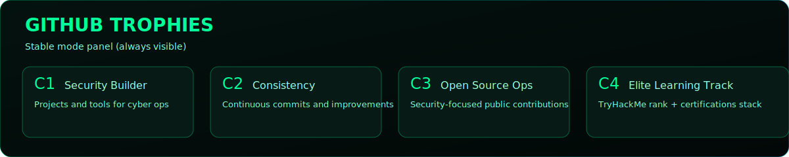

[README.md](https://github.com/user-attachments/files/25353143/README.md)
<!--
GitHub username is set to `piyush295`.
Replace `piyush295` everywhere only if your username changes.
For profile README, place this file in repo: github.com/<username>/<username>
-->

  

<h1 align="center">PIYUSH KUMAR</h1>
<h3 align="center">Hacker | Cybersecurity Specialist | Cyber/Electronic Operations & Warfare | Digital Forensics | Cyber Crime Investigator | Author</h3>

  

  
  
  
  

  
  
  

<table align="center">
  <tr>
    <td>
      <pre>
$ whoami
Piyush Kumar | Hacker | Cybersecurity Specialist

$ mission --active
[+] Offensive Security Assessments
[+] SOC Monitoring and Incident Response
[+] Digital Forensics and Cyber Crime Investigation
[+] Cyber Awareness and National Security Support
      </pre>
    </td>
  </tr>
</table>

## Threat Operations Matrix

| Layer | Focus | Capabilities |
|---|---|---|
| Recon | Threat surface mapping | OSINT, attack-path analysis, vulnerability discovery |
| Offensive | Controlled adversary simulation | Web/network pentesting, red teaming, exploit validation |
| Defensive | Detection and response | SOC operations, alert triage, incident handling |
| Forensics | Evidence and attribution | Digital forensics, cyber crime investigation, reporting |

## Cyber Arsenal

  

  
  
  
  
  

## Live GitHub Command Center

  
  

  

  
  

  

> If cards are not visible yet: run workflow `Generate Profile Summary Cards` once in the `Actions` tab.

## Professional Highlights

- Cyber Volunteer, Government of India (Samastipur, Bihar), July 2024 - Present
- Junior Security Professional (DCJSP), Defronix Cyber Security, Feb 2024 - Nov 2024
- Google Cloud Computing Foundations Intern, SmartInternz, Jan 2024 - Mar 2024
- Salesforce Developer Intern, SmartInternz, Dec 2023 - Jan 2024
- TryHackMe global rank: `#145`

## Certification Radar

- Red Teaming
- SOC Level 1 and SOC Level 2
- CompTIA PenTest+
- Digital Forensics Essentials (DFE)
- Ethical Hacker Essentials (EC-Council)
- DevSecOps
- Cyber Defence
- Google Cloud Computing Foundations

## Published Books

- `Hacker's Shadow` - ISBN: `978-93-5655-516-7`
- `Electronic Evidence and Cyber Crime Investigation` - ISBN: `978-93-5679-872-4`
- `The Practical Guide to Cloud Security` - ISBN: `978-93-5659-937-6`

## Connect

- Location: `Samastipur, Bihar, India`
- Email: `mr.piyush295@gmail.com`
- LinkedIn: `linkedin.com/in/hackerpiyush295`

  

