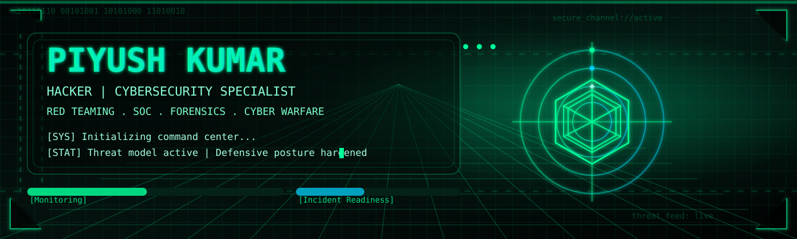

<!--
  GitHub profile README for user `piyush295`.
  Lives in repo: github.com/piyush295/piyush295
  Fully animated. Cards/graphs are generated by GitHub Actions workflows:
    - .github/workflows/snake.yml      -> contribution snake animation
    - .github/workflows/summary-cards.yml -> profile summary cards
  Run them once from the Actions tab (or push to main) to populate.
-->

<!-- ============== HEADER ============== -->

  

<h1 align="center">PIYUSH KUMAR</h1>
<h3 align="center">Hacker · Cybersecurity Specialist · Penetration Tester · SOC Analyst (SAL1) · Digital Forensics · Author</h3>

  

<!-- ============== SOCIAL / BADGES ============== -->

  
  
  
  
  

  
  
  

<!-- ============== WHOAMI ============== -->
<table align="center">
  <tr>
    <td>
      <pre>
$ whoami
Piyush Kumar | Founder & Director @ RAKSHANEX TECHNOLOGIES

$ mission --active
[+] Offensive Security Assessments & Red Teaming
[+] SOC Monitoring, Threat Hunting & Incident Response
[+] Digital Forensics & Cyber Crime Investigation
[+] Secure OS Engineering (OmniCore OS)
[+] Cyber Awareness & National Security Support
      </pre>
    </td>
  </tr>
</table>

## Threat Operations Matrix

| Layer | Focus | Capabilities |
|---|---|---|
| Recon | Threat surface mapping | OSINT, attack-path analysis, vulnerability discovery |
| Offensive | Controlled adversary simulation | Web/network pentesting, red teaming, exploit validation |
| Defensive | Detection and response | SOC L1/L2, SIEM, alert triage, incident handling |
| Forensics | Evidence and attribution | Digital forensics, cyber crime investigation, chain-of-custody |

## Cyber Arsenal

  

  
  
  
  
  

<!-- ============== ANIMATED GITHUB STATS ============== -->
## Live GitHub Command Center

  
  

  

<!-- Animated contribution activity graph -->

  

<!-- ============== ANIMATED SNAKE (generated by workflow) ============== -->

  

<!-- ============== TROPHIES ============== -->

  

> First-time setup: open the **Actions** tab and run **Generate Snake** once so the animation above renders.

## Professional Highlights

- Founder & Director, RAKSHANEX TECHNOLOGIES, Mar 2026 - Present
- Official Cyber Volunteer, Government of India (Samastipur, Bihar), Jul 2024 - Present
- Junior Security Professional (DCJSP), Defronix Cyber Security, 2024
- Google Cloud Computing Foundations Intern, SmartInternz, Jan 2025 - Mar 2025
- Salesforce Developer Intern, SmartInternz, Dec 2023 - Jan 2024
- TryHackMe global rank: `#145`

## Certification Radar

- Security Analyst Level 1 (SAL1) - TryHackMe (Sep 2026)
- CompTIA PenTest+
- SOC Level 1 and SOC Level 2
- Red Teaming
- Digital Forensics Essentials (DFE)
- Ethical Hacking Essentials (EC-Council)
- DevSecOps · Cyber Defence · Security Engineer
- Google Cloud Computing Foundations
- 50+ certifications across EC-Council, Cisco, Google, IBM & universities

## Published Books

- `ZERO ANONYMITY: Every Criminal Leaves a Trace` - ISBN: `978-93-6012-603-2`
- `Electronic Evidence and Cyber Crime Investigation` - ISBN: `978-93-5679-872-4`
- `Hacker's Shadow` - ISBN: `978-93-5655-516-7`
- `The Practical Guide to Cloud Security` - ISBN: `978-93-5659-937-6`

## Flagship Projects

- **OmniCore OS** - sovereign, security-hardened Linux distribution built from source (LFS).
- **AgentTrace** - local-first DFIR tool for forensic reconstruction of AI-agent incidents (MITRE ATLAS, EU AI Act).
- **RUDRA** - fast, safe systems programming language.

## Connect

- Portfolio: `piyushsec.vercel.app`
- Email: `mr.piyush295@gmail.com`
- LinkedIn: `linkedin.com/in/hackerpiyush295`
- TryHackMe: `tryhackme.com/p/hacker295`

  

